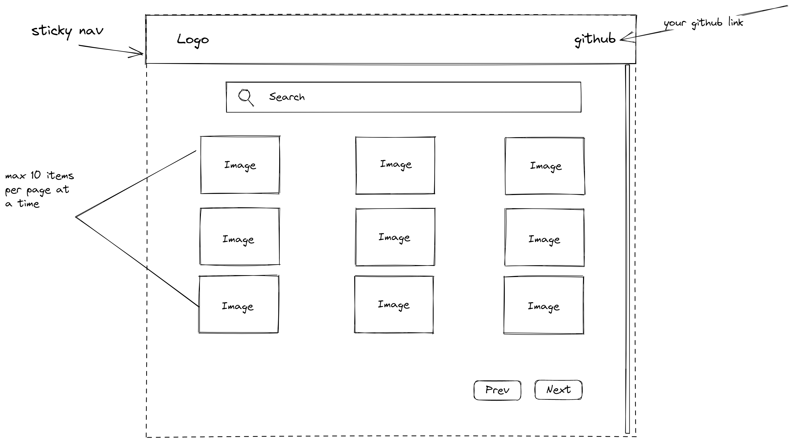

# Salt Gallery - Step 1 - Building the MVP

## MVP

A minimum viable product (MVP) is a version of a product with just enough features to satisfy early customers and provide feedback for future product development.

## Objectives

- Setting up a project from scratch with testing, linting and tests (using [Vite](https://vitejs.dev/)).
- Learn how to build a single page application with Typescript.
- State management view. The view should change based on the data that you retrieve and store in a state. The state in its simple form is a variable having an object stored in it.
- Setting, getting and updating data to and from localStorage.
- Testing your application with jest.

## MVP specifications

### Github repository setup

You will not be working towards our repository this time. Instead, you'll set up your own Github repo. The repository must have two branches - `main` and `development`. You should be working towards the development branch.

> Note: After initial commit in `main`, derive your `development` branch right away so all the further comments first are in `development`, and then are merged to `main` later.

### Tech stack specifications

The project _must_:

1. Be linted.
2. Have unit tests that run using Jest as a testrunner.
3. Have e2e tests using Cypress.
4. Have only _one_ `index.html`. I.e. we should have a single page app (SPA).
5. Have _multiple_ TypeScript files and any imports from one file to another should be made using ES6 import/export syntax (e.g. `import fetcher from './fetcher'`).
6. Be styled using CSS. Keep mobile responsiveness in mind.

[Vite](https://vitejs.dev/) is probably fairly new to many of you. Go through its **Get Started** section to see how to create a TypeScript based web app. You should be using the CLI to create the project in your machine, and not the online stackblitz version.

### MVP requirements

We want you to build an application similar to the following 'design'. Remember to write tests along the way to make sure that your functions are working as they should.

We require that the application:

1. Has a form which, on submit, fetches images from the [Unsplash API /search/photos endpoint](https://unsplash.com/documentation#search-photos). You'll have to set up a developer account and get an API key for making your requests. Remember to put your API key in an environment variable which is usually done using a .env file. Read more about environment variables with Vite [here](https://vitejs.dev/guide/env-and-mode.html) and follow it accurately. Make sure to see the SECURITY NOTES message there. **You should not commit the .env file to GitHub.**

2. When the user focuses the search input, a 'suggestions' list should be shown down below as shown in the 2nd design image. The suggestions list should be based on any previous searches. We want you to do this by saving the previous searches in [Window.localStorage](https://developer.mozilla.org/en-US/docs/Web/API/Window/localStorage) (which is like a database in the browser).

3. When you get a response from the Unsplash API, render the 10 images as cards on the web page. Tip: save the result in a state variable and render a list based on that state.

4. Every card should have a flip/rotate animation. On the backside of each card, list some text information from the Unsplash API response.

Bonus: If you complete all above, add pagination functionality so that when clicking the `next` button, the 10 next images should be displayed. There should also be a `previous` button which fetches the previous 10 images.

---

Good luck and have fun!
